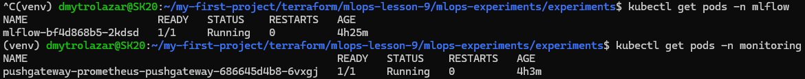
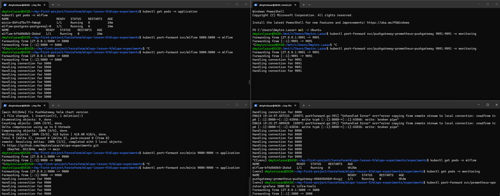
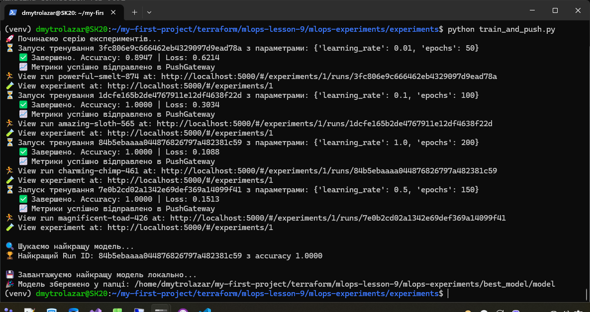
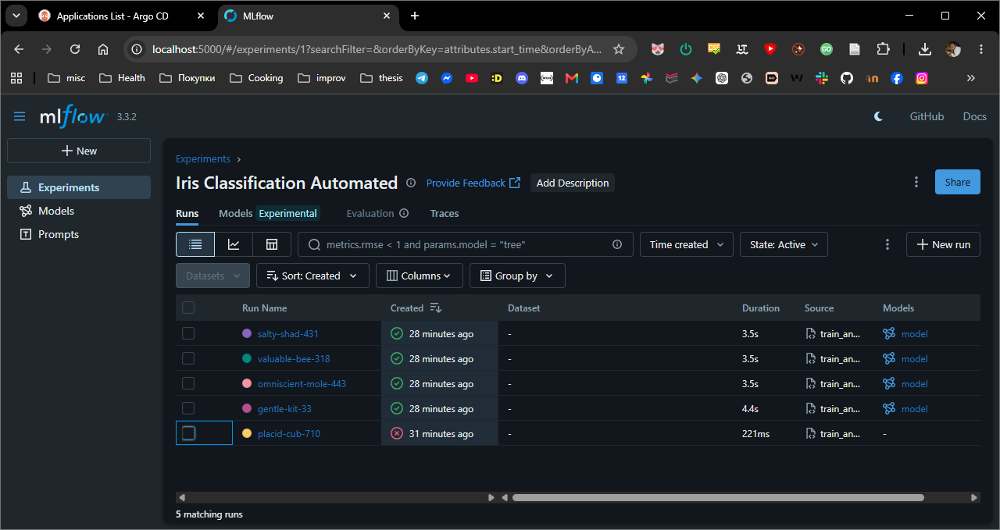
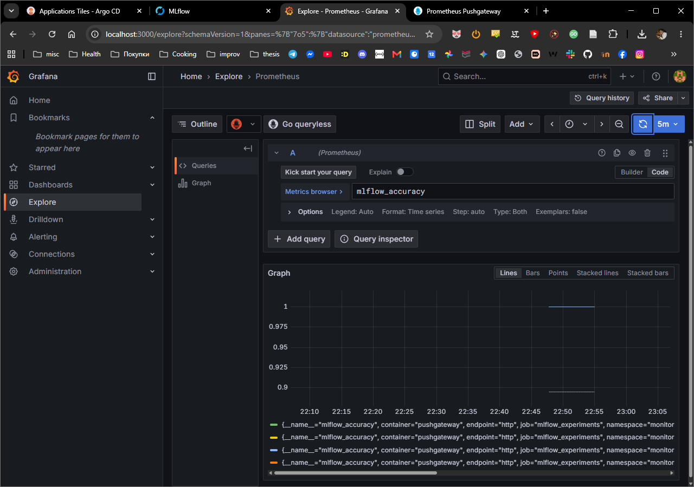

# **MLOps Project: GitOps Infrastructure & ML Tracking**

Цей репозиторій містить конфігурації та скрипти для розгортання MLOps інфраструктури (MLflow, MinIO, Prometheus, Grafana) через ArgoCD та запуску автоматизованих ML-експериментів.

Нижче наведено покрокову інструкцію, як перевірити кластер, отримати доступ до інструментів та запустити пайплайн навчання моделі.

## **🛠 Крок 1\. Перевірка наявності MLflow та PushGateway у кластері**

Перед запуском скриптів необхідно переконатися, що інфраструктура успішно розгорнута через ArgoCD. Для цього перевірте статус подів у відповідних неймспейсах:

\# Перевірка MLflow (та бази даних)  
kubectl get pods \-n mlflow

\# Перевірка PushGateway  
kubectl get pods \-n monitoring

Усі поди повинні мати статус Running.

А ось це результат реального виконання цієї команди у моєму кластері:  

## **🚪 Крок 2\. Налаштування доступу (Port-Forward)**

Оскільки сервіси знаходяться всередині Kubernetes, для доступу до них з локальної машини потрібно прокинути порти.

Відкрийте **окремі вкладки термінала** для кожного сервісу і виконайте наступні команди (залиште їх працювати у фоні):

**1\. Доступ до MLflow UI:**

kubectl port-forward svc/mlflow 5000:5000 \-n mlflow

**2\. Доступ до MinIO (для збереження артефактів моделей):**

kubectl port-forward svc/minio 9000:9000 \-n application

**3\. Доступ до PushGateway (для прийому метрик):**

kubectl port-forward svc/pushgateway-prometheus-pushgateway 9091:9091 \-n monitoring

**4\. Доступ до Grafana (для перегляду дашбордів):**

kubectl port-forward svc/prometheus-operator-grafana 3000:80 \-n infra-tools

## **🚀 Крок 3\. Як запустити train\_and\_push.py**

Після того як порти прокинуті, можна запускати ML-експеримент. Скрипт проведе серію тренувань моделі класифікації Iris, відправить дані в MLflow та метрики в Prometheus.

Відкрийте новий термінал і виконайте наступне:

\# 1\. Перейдіть у папку зі скриптом  
cd experiments/

\# 2\. Створіть та активуйте віртуальне середовище (якщо ще не зроблено)  
python3 \-m venv venv  
source venv/bin/activate

\# 3\. Встановіть залежності  
pip install \-r requirements.txt

\# 4\. Запустіть скрипт  
python train\_and\_push.py

Скрипт автоматично підключиться до localhost:5000 та localhost:9091. Після завершення він завантажить найкращу модель у локальну папку best\_model/.

А ось так виглядає мій реальний запуск цього скрипта з логами тренування:  

## **📊 Крок 4\. Перегляд результатів у MLflow UI**

Тепер результати можна переглянути у веб\-інтерфейсі.

1. Відкрийте браузер і перейдіть за адресою: [http://localhost:5000](http://localhost:5000)  
2. Зліва у меню виберіть експеримент **"Iris Classification Automated"**.  
3. Тут ви побачите всі запуски (Runs), їх метрики (accuracy, loss), а також збережені артефакти моделей у MinIO.

Ось реальний скріншот інтерфейсу MLflow з моїми збереженими експериментами:  

## **📈 Крок 5\. Як подивитись метрики в Grafana**

Метрики кожної ітерації також відправляються до Prometheus PushGateway і доступні для візуалізації в Grafana.

1. Відкрийте браузер і перейдіть за адресою: [http://localhost:3000](http://localhost:3000)  
2. **Логін:** admin | **Пароль:** prom-operator (якщо не було змінено в налаштуваннях).  
3. У лівому меню натисніть на іконку компаса **(Explore)**.  
4. У випадаючому списку джерел даних оберіть **Prometheus**.  
5. У полі "Metric" введіть mlflow\_accuracy або mlflow\_loss і натисніть кнопку **Run query**.

Ви побачите графік зі змінами метрик моделі в процесі експериментів.

А ось це результат відображення метрик mlflow\_accuracy після мого запуску:  

